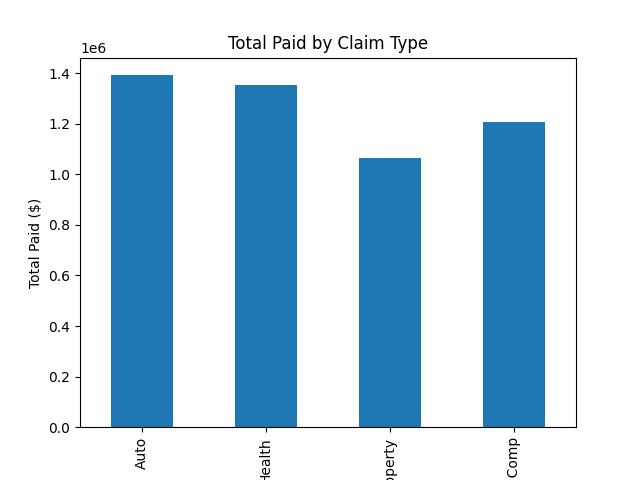
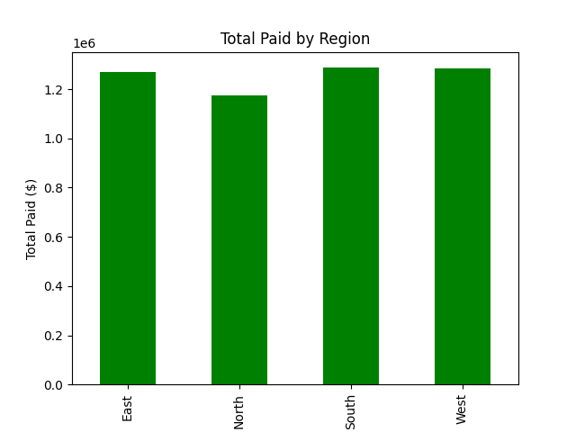

# Claims Analysis Project

## Overview
This project demonstrates data analysis and visualization skills using **Python, SQL, and matplotlib**.  
It uses a dummy claims dataset to calculate key metrics, generate insights, and visualize patterns, simulating real-world claims analysis tasks.

---

## Skills Demonstrated
- **Python**: pandas for data manipulation, matplotlib for visualization  
- **SQL**: querying an SQLite database to extract KPIs  
- **Data Analysis**: calculating totals, averages, top claims, and aggregations  
- **Data Visualization**: bar charts and plots to show trends and comparisons  
- **Portfolio-ready project**: fully documented, reproducible, and visual insights

---

## Dataset
- Generated dummy claims data (`claims_data.csv`)  
- Fields included:
  - `ClaimID` (unique identifier)
  - `Date` (claim date)
  - `Region` (North, South, East, West)
  - `ClaimType` (Auto, Health, Property, Workers Comp)
  - `Amount` (claim amount in USD)  

---

## Key Metrics Calculated
- **Total Claims**: `500` (example)  
- **Total Paid**: `$X,XXX,XXX`  
- **Average Claim Paid**: `$XX,XXX`  
- **Top 10 Claims**: displayed in table or chart  
- **Claims by Type & Region**: counts and total paid  

---

## Charts
The project generates charts saved in the `charts/` folder:
1. `total_paid_by_type.png` – shows total amount paid by claim type  
2. `total_paid_by_region.png` – shows total amount paid by region  
3. `top_10_claims.png` – shows the 10 highest claims  




---

## Insights
- **Auto claims** are the most frequent, but **Property claims** have the highest total payout.  
- The **West region** shows higher average claim amounts than other regions.  
- Top 10 claims highlight areas for focus in claims management or risk analysis.  

*(These insights are based on dummy data but demonstrate analytical thinking.)*

---

## How to Run
1. Clone the repository:

```bash
git clone <your-repo-URL>
cd claims_project
